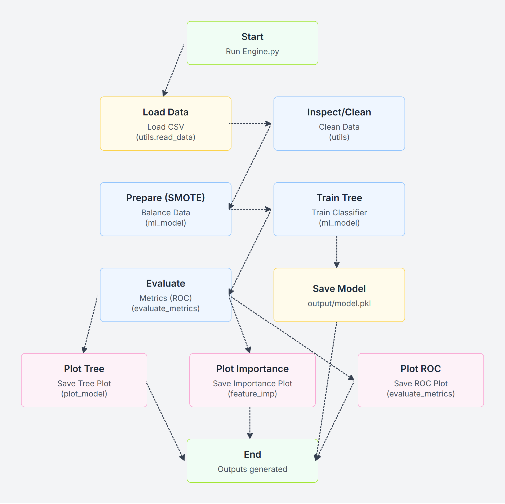

# Customer Churn Prediction using Decision Trees

This project demonstrates how to predict customer churn using a Decision Tree Classifier. The model analyzes customer data such as subscription details, watch time, and interaction history to identify patterns and predict the likelihood of a customer leaving. It utilizes techniques like SMOTE for handling imbalanced data.



## Project Structure

```
.
├── README.md
├── input/
│   └── data_regression.csv # Input dataset
├── output/                 # Generated output files
│   ├── Decision_Tree_plot.png # Visualization of the trained Decision Tree
│   ├── Feature_Importance.png # Plot showing feature importances
│   ├── Log_ROC.png            # ROC curve plot (Note: filename might differ based on actual output)
│   └── model.pkl              # Saved trained Decision Tree model
└── src/                    # Source code
    ├── Engine.py           # Main script to run the pipeline
    ├── requirements.txt    # Project dependencies
    └── ML_Pipeline/        # Directory containing ML pipeline modules
        ├── evaluate_metrics.py # Functions for model evaluation (confusion matrix, ROC)
        ├── feature_imp.py      # Function for plotting feature importance
        ├── ml_model.py         # Functions for data preparation (SMOTE) and model training
        ├── plot_model.py       # Function for plotting the decision tree
        └── utils.py            # Utility functions (e.g., reading data)
```

## Installation

1.  Clone the repository:
    ```bash
    git clone https://github.com/AbdooMohamedd/Customer-Churn-Prediction-using-Decision-Trees.git
    cd Customer-Churn-Prediction-using-Decision-Trees
    ```
2.  Install the required dependencies:
    ```bash
    pip install -r requirements.txt
    ```

## Usage

Navigate to the `src` directory and run the main engine script:

```bash
cd src
python Engine.py
```

This will execute the entire pipeline: data loading, preprocessing, model training, evaluation, and saving the results.

## Workflow

The main script [`src/Engine.py`](src/Engine.py) performs the following steps:

1.  **Load Data:** Reads the customer data from [`input/data_regression.csv`](input/data_regression.csv) using [`ML_Pipeline.utils.read_data`](src/ML_Pipeline/utils.py).
2.  **Data Inspection & Cleaning:** Performs initial data inspection and handles null values using functions from [`ML_Pipeline.utils`](src/ML_Pipeline/utils.py).
3.  **Data Preparation:** Prepares the data for modeling using SMOTE (Synthetic Minority Over-sampling Technique) to handle class imbalance via [`ML_Pipeline.ml_model.prepare_model_smote`](src/ML_Pipeline/ml_model.py).
4.  **Model Training:** Trains a Decision Tree Classifier using [`ML_Pipeline.ml_model.run_model`](src/ML_Pipeline/ml_model.py).
5.  **Evaluation:** Evaluates the model using a confusion matrix ([`ML_Pipeline.evaluate_metrics.confusion_matrix`](src/ML_Pipeline/evaluate_metrics.py)) and ROC curve ([`ML_Pipeline.evaluate_metrics.roc_curve`](src/ML_Pipeline/evaluate_metrics.py)).
6.  **Visualization:**
    - Plots the trained decision tree using [`ML_Pipeline.plot_model.plot_model`](src/ML_Pipeline/plot_model.py) and saves it to [`output/Decision_Tree_plot.png`](output/Decision_Tree_plot.png).
    - Plots feature importances using [`ML_Pipeline.feature_imp.plot_feature_importances`](src/ML_Pipeline/feature_imp.py) and saves it to [`output/Feature_Importance.png`](output/Feature_Importance.png).
7.  **Save Model:** Saves the trained model as a pickle file to [`output/model.pkl`](output/model.pkl).

## Output

The script generates the following files in the [`output/`](output/) directory:

- [`model.pkl`](output/model.pkl): The serialized, trained Decision Tree model.
- [`Decision_Tree_plot.png`](output/Decision_Tree_plot.png): A visual representation of the decision tree.
- [`Feature_Importance.png`](output/Feature_Importance.png): A bar chart showing the importance of each feature in the model's predictions.
- [`Log_ROC.png`](output/Log_ROC.png): The Receiver Operating Characteristic (ROC) curve plot for the model.

## Dependencies

The project relies on the following Python libraries (see [`src/requirements.txt`](src/requirements.txt) for specific versions):

- imbalanced-learn
- numpy
- matplotlib
- pandas
- scikit-learn
